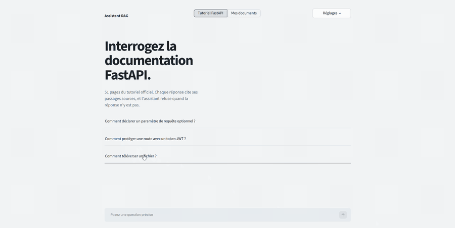
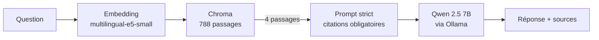

# Assistant RAG local : posez vos questions à vos documents

Assistant de questions-réponses sur documents, **100 % local et gratuit** (Ollama, Chroma,
Streamlit). Deux modes :

- **Tutoriel FastAPI** : corpus intégré (51 pages en anglais), questions en français, réponses
  avec **citations [n]**, **refus** quand la réponse n'est pas dans les documents. C'est sur ce
  corpus que la qualité est mesurée (section Résultats).
- **Mes documents** : dépôt de PDF, Markdown ou TXT (10 fichiers, 15 Mo chacun) ; l'assistant
  répond uniquement à partir de ces fichiers et cite le document et la page. Les index
  « Mes documents » sont temporaires : supprimés au changement de documents et au redémarrage
  de l'API. **La qualité n'est pas mesurée sur ce mode.**



## Comment ça marche



- **Corpus** : `docs/en/docs/tutorial` du dépôt FastAPI (licence MIT) : 51 pages, 788 passages
  de 1 000 caractères maximum, découpés par paragraphes (blocs de code jamais coupés).
- **Code des exemples** : le tutoriel charge ses exemples depuis un dossier `docs_src/`.
  `src/fetch_code.py` récupère les 173 fichiers référencés et `src/ingest.py` les insère dans
  les passages (voir « Ce que la comparaison a montré »).
- **API** : FastAPI (`POST /ask`, `POST /documents`, `DELETE /documents/{collection}`, `GET /health`).
  **Interface** : Streamlit.

## Résultats

Jeu d'évaluation : **54 questions en français** (`eval/questions.jsonl`) : 44 questions dont la
page attendue est connue, et 10 hors corpus (7 sans rapport, 3 sur FastAPI mais absentes du
sous-ensemble : Docker, WebSockets, Kubernetes). Matériel : RTX 4070 12 Go, 15,8 Go de RAM.

**Recherche** (44 questions du corpus ; réussite = la page attendue est dans les k premiers passages)

| Réglage | Recall@1 | Recall@3 | Recall@5 | MRR |
|---|---|---|---|---|
| A. Texte seul (576 passages) | 77,3 % | 88,6 % | 93,2 % | 0,841 |
| B. Texte + code des exemples (788 passages) | 79,5 % | 90,9 % | 90,9 % | 0,851 |

Une question vaut 2,3 points : ces écarts ne sont pas significatifs.

**Chaîne complète** (k = 4, Qwen 2.5 7B, température 0)

| | A. Base | B. + code des exemples | C. B + prompt strict |
|---|---|---|---|
| Refus correct hors corpus | 100 % (10/10) | 100 % | 100 % |
| Faux refus (questions valides) | 9,1 % | 9,1 % | 6,8 % |
| Réponses avec citation valide | 87,5 % | 75,0 % | **100 %** |
| Réponses avec code absent des passages | 52,5 % (21/40) | 30,0 % (12/40) | **22,0 %** (9/41) |
| Fidélité (15 mêmes questions, notée par LLM) | 27 % (4/15) | 67 % (10/15) | 73 % (11/15) |
| Latence de bout en bout (médiane / p95) | 3,5 s / 4,9 s | 4,0 s / 6,0 s | 3,8 s / 5,6 s |

Réglage retenu : **C** (utilisé par l'API et l'interface).

### Ce que la comparaison a montré

1. **Le code des exemples est le gain décisif.** Sans lui, le modèle inventait du code dans
   plus de la moitié des réponses (les extraits n'en contenaient pas). Avec lui, la part tombe
   à 30 %, puis 22 % avec le prompt strict.
2. **Un seuil sur le score de similarité ne permet pas de refuser.** Le plus bas score d'une
   question valide (0,809) est inférieur au plus haut score d'une question hors corpus (0,886) :
   les questions sur FastAPI absentes du corpus ressemblent trop aux autres. Le refus repose
   donc sur le modèle de génération (10/10 ici).
3. **Le prompt strict corrige surtout les citations** (75 % → 100 %). Son effet sur la fidélité
   (10/15 → 11/15) n'est pas démontrable avec 15 réponses.

## Limites assumées

- **Fidélité notée par un LLM** (Claude), sur 15 réponses seulement, avec une règle stricte :
  tout code ou affirmation absent des passages = non fidèle. Ce n'est pas une notation humaine
  indépendante ; les commentaires par réponse sont dans `eval/faithfulness_*.csv`.
- **Vérité terrain au niveau de la page**, pas du passage : Recall@k mesure si la bonne page
  est retrouvée, pas si le bon passage répond à la question. Les pages attendues ont été
  vérifiées par la présence d'un mot-clé dans la page, pas par une relecture complète.
- **Un modèle de 7 milliards de paramètres ne suit pas toujours la consigne** : 4 des 15
  réponses notées restent non fidèles (code inventé pour CORS et les sous-dépendances, réponse
  hors sujet sur les codes HTTP, fonction montrée à la place d'une classe).
- **Questions de définition faibles** (« qu'est-ce que FastAPI ? ») : le tutoriel n'a pas de
  page de présentation, la réponse est approximative.
- **Mode « Mes documents » non évalué** : pas de jeu de questions, pas de mesure de fidélité ;
  PDF scannés non gérés (pas d'OCR) ; les questions larges (« résume ce document ») sont mal
  adaptées à une recherche des 4 meilleurs passages.
- Corpus mesuré : un seul (51 pages), pas de reranking, pas de conversation à plusieurs tours, fichiers
  d'exemples insérés en entier (pas les lignes mises en avant).
- Mesures faites sur une seule machine ; les latences dépendent du GPU.

## Lancer le projet

Prérequis : Python 3.12, [Ollama](https://ollama.com) et `ollama pull qwen2.5:7b-instruct`.
Le corpus (`data/docs`, `data/docs_src`) est déjà dans le dépôt.

```
python -m venv .venv
.venv\Scripts\activate
pip install -r requirements.txt
python -m src.ingest --with-code --collection fastapi_code
python -m uvicorn api.main:app --port 8000
python -m streamlit run app.py        # dans un second terminal
```

Reproduire l'évaluation (Ollama lancé) :

```
python -m src.evaluate --retrieval --collection fastapi_code --tag code
python -m src.evaluate --generation --collection fastapi_code --prompt strict --tag code_strict
python -m src.evaluate --report base
python -m pytest
```

Pour reconstruire le réglage A : `python -m src.ingest` (collection `fastapi_docs`), puis
`python -m src.evaluate --generation --tag base`.

## Structure

```
api/main.py         API (/ask, /documents, /health)
app.py              interface Streamlit
src/ingest.py       nettoyage, découpage, embeddings, index Chroma
src/documents.py    dépôt de fichiers utilisateur (PDF/MD/TXT) : lecture, découpage, index temporaire
src/fetch_code.py   récupération des exemples de code référencés
src/retrieve.py     recherche (CLI : python -m src.retrieve "question")
src/generate.py     prompts, appel Ollama, refus
src/evaluate.py     Recall@k, MRR, refus, citations, code inventé, latence
eval/               questions, résultats, notation de fidélité
tests/              35 tests (découpage, documents, API, interface, évaluation)
```

Corpus : documentation FastAPI, licence MIT (`data/docs/LICENSE-fastapi`).
